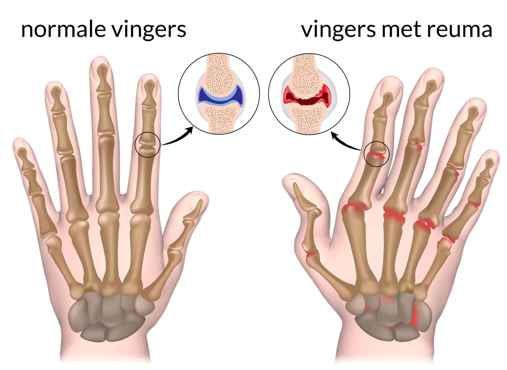

# Genexpressie-analyse duidt op duidelijke verschillen in patiënten met reumatoïde artritis.

  
   
  Bron: <a href="https://livit.nl/hulp-bij/hand/reuma-in-de-handen/">Livit</a>

 
Door: Crispijn Oppenhuizen 
Klas: LBM2-B

# Inhoud
- `Assets/` bestanden voor de opmaak van README.md
- `Bronnen/` gebruikte bronnen
- `Data stewardship/` beschrijving over data beheren op Github
- `Data/` gebruikte data
- `Data/Data_RA_raw` ruwe dataset die gebruikt is voor de analyse
- `Data/aligned Data` aligned data die is geproduceerd van de ruwe dataset
- `Resultaten/` geproduceerde grafieken en tabellen door middel van script
- `Scripts/` gebruikte script voor de analyse

---

# Inleiding
Reumatoïde artritis(RA) is een chronische ontstekingsziekte in de gewrichten, het is een auto-immuun ziekte waarvan de oorzaak nog niet duidelijk is. De ziekte kan uiteindelijk zorgen voor schade aan de gewrichten en organen ([Radu & Bungau, 2021](Bronnen/RaduBungau2021.pdf)). RA is te onderscheiden van andere auto-immuun ziektes door synoviale ontsteking, productie van antilichamen zoals reumafactor(RF) en anti-citrullinated protein antibodies(ACPA) en botvervorming ([Jang et al., 2022](Bronnen/Jang2022.pdf)). De ziekte komt vooral voor in vrouwen en oudere mensen, maar niet exclusief tot deze groepen. De oorzaak van de ziekte is nog niet bekend, maar wel is duidelijk omgevingsfactoren, zoals roken een rol spelen in de ontwikkeling van RA. Ook spelen genetische factoren een grote rol in RA ([Scott et al., 2010](Bronnen/Scott2010.pdf)). Een gen familie in het bijzonder komt voortdurend voor bij patiënten met RA, dit zijn de HLA DRB1 allelen in het MHC op chromosoom 6. De HLA regio codeert voor de MHC klasse 1 en 2 receptoren. Waaronder de alpha en beta ketens van de MHC klasse 2 receptoren. De receptoren zitten op antigeen presenterende cellen en presenteren deze aan T-cellen ([Dedmon, 2020](Dedmon2020.pdf)). Verder is het niet helemaal duidelijk welke genetische factoren er meer een rol spelen in RA. Dit onderzoek probeert hier meer duidelijkheid over te krijgen door de synoviale vloeistof van verschillende mensen te analyseren en hier de verschillen in genexpressie duidelijk te maken.  

# Methode
## Verkregen data
De data dat is gebruikt in dit onderzoek is verkregen door Ilumina sequencing. De sequencing is gedaan met het synoviale vloeistof uit 8 vrouwelijke personen, waarvan 4 een diagnose van RA hebben voor langer dan 12 maanden en 4 zonder RA, waarvan de personen met RA positief testen op ACPA en de gezonden negatief. Verder staan er in tabel 1 meer data over de personen waarvan de samples zijn. De data verwerking wordt gedaan volgens de flowchart in figuur 1.

*Tabel 1 Meta data van personen voor onderzoek*
| Monster ID | Leeftijd | Geslacht   | Status         |
| ---------- | :------: | ---------- | :------------: |
| SRR4785819 | 31       | Vrouwelijk | Controle       |
| SRR4785820 | 15       | Vrouwelijk | Controle       |
| SRR4785828 | 31       | Vrouwelijk | Controle       |
| SRR4785831 | 42       | Vrouwelijk | Controle       |
| SRR4785979 | 54       | Vrouwelijk | Reuma Artritis |
| SRR4785980 | 66       | Vrouwelijk | Reuma Artritis |
| SRR4785986 | 60       | Vrouwelijk | Reuma Artritis |
| SRR4785988 | 59       | Vrouwelijk | Reuma Artritis |

*Figuur 1 Flowchart RNA data analyse*

## RNA Data verwerking
De verkregen data is verder geanalyseerd in R studio (2025.05.1 Build 513) met R (v4.5.1). De verkregen data is eerst aligned op het geindexeerde menselijk genoom met Rsubread ([v2.22.1](http://bioconductor.org/packages/Rsubread). De referentie voor het menselijk genoom dat is gebruikt voor de index is van Ensembl ([Homo_sapiens.GRCh38.dna.toplevel.fa.gz](https://ftp.ensembl.org/pub/release-114/fasta/homo_sapiens/dna/Homo_sapiens.GRCh38.dna.toplevel.fa.gz)). Met de aligned sample data wordt een count matrix gemaakt met Rsubread ([v2.22.1](http://bioconductor.org/packages/Rsubread) en het menselijk GTF annotatie van Ensembl ([Homo_sapiens.GRCh38.114.chr.gtf.gz](https://ftp.ensembl.org/pub/release-114/gtf/homo_sapiens/Homo_sapiens.GRCh38.114.chr.gtf.gz))

## Differentiële genexpressie analyse
Het count matrix wordt gebruikt in een differentiële genexpressie analyse met DESeq2 ([v1.48.1](https://github.com/thelovelab/DESeq2)). De analyse wordt verder in een Volcano plot gezet met EnhancedVolcano ([v1.26.0](https://github.com/kevinblighe/EnhancedVolcano)). 

## Pathway en GO enrichment analyse
De data uit de differentiële genexpressie analyse wordt gebruikt in de GO enrichment analyse en een KEGG pathway analyse. De GO Enrichment analyse wordt gedaan met clusterProfiler ([v4.16.0](https://yulab-smu.top/contribution-knowledge-mining/)). Ook wordt org.Hs.eg.db (v3.21.0) met de benodigheid AnnotationDbi ([v1.70.0](https://bioconductor.org/packages/release/bioc/html/AnnotationDbi.html)) gebruikt als annotatie voor de analyse. Met de data uit de analyse wordt een grafiek gemaakt door middel van ggplot2(v[3.5.2](https://ggplot2.tidyverse.org)) en scales ([v1.4.0](https://scales.r-lib.org)). De KEGG pathway analyse wordt gedaan met de pathway hsa05323 en de packages pathview ([v1.48.0](https://github.com/datapplab/pathview)) en KEGGREST ([v1.48.0](https://bioconductor.org/packages/KEGGREST)).

# Resultaten
## Differentiële genexpressie analyse
De differentiële genexpressie analyse laat zien dat er grote significante verschillen zijn tussen de RA en controle groepen zoals te zien is in figuur 2. 

*Figuur 2 Volcano plot van differentiële genexpressie analyse. Niet statistisch significante genen zonder biologisch relevantie zijn grijs, Wel biologisch relevant maar niet statistisch significant is groen en beide biologisch relevant en statistisch significant is rood.*

## GO enrichment analyse
Er is een GO enrichment analyse gedaan om de statistisch significante genen te linken aan een functie van een gen. Hieruit komen [GO termen](Resultaten/EnrichmentAnalysis.png) met een statistisch significantie. Hierin is te zien wat voor functie de significante genen hebben. De term *adaptive immune response based on somatic recombination of immune recpetops built from immunoglobulin superfamily domains* heeft de hoogste significantie. 

## KEGG pathway analyse
De [KEGG pathway analyse](KEGGPathway.png) laat zien dat er grote upregulatie is in de MHCII genen wat leidt tot downregulatie in de TGFβ genen. Maar wel upregulatie met auto imuun T-cellen.

# Discussie
RA is een auto-immuun ziekte dat zorgt voor gewrichtschade. De oorzaak van de ziekte is nog niet duidelijk, maar wel is duidelijk dat genetische factoren een rol spelen in het ontwikkelen van de ziekte. Dit onderzoek is gedaan om meer duidelijkheid te krijgen welke genen een rol spelen bij dit proces, dit is gedaan door het synoviale vloeistof van 8 personen af te nemen waarvan 4 RA hebben en 4 controles zijn. Er is verder een Illumina sequencing gedaan met deze vloeistof, waar de genexpressie is gemeten. In dit onderzoek is deze RNA sequencing data geanalyseerd. Er is een differentiële genexpressie gedaan wat de significante verschillen in genexpressie uit de data haalt. Deze data is verder gebruikt om een GO enrichment analyse te doen. Hieruit is gekomen dat de GO term *adaptive immune response based on somatic recombination of immune recpetops built from immunoglobulin superfamily domains* als hoogste significantie eruit kwam, dit is in een eerder onderzoek ook gemeten([Dedmon, 2020](Dedmon2020.pdf)). Uit dit onderzoek kwam dat er een verschil is in de MHC klasse 2 receptoren van mensen met RA. Verder komen uit de GO enrichment meerdere immuun processen wat ook gelijk loopt met het feit dat RA een auto-immuun ziekte is. In de KEGG pathway analyse wordt het verschil in de MHC klasse 2 receptoren ook weer verder vast gesteld. Dit verschil zorgt voor verschillende expressie van andere genen verder in de pathway, zoals de expressie van IL8, CXCL1 en CXCL5, die zorgen voor ontsteking aan de bloedvaten. Ook een verschil in expressie van MMP1/3 zorgt voor gewricht schade wat past bij RA. Echter is dit onderzoek maar een klein beeld van de gehele populatie met RA, sinds dit onderzoek een kleine test groep neemt van 8 personen in totaal. Waarvan het allemaal vrouwen zijn wat leidt tot potentieel onbekende verschillen tussen man en vrouw. Ook is de leeftijd verschil tussen de controle groep en RA groep te groot om duidelijk een verschil in expressie tussen gezond en RA te maken dat niet een verschil is tussen jong en oud. Daarom zou dit onderzoek opnieuw moeten worden gedaan met een grotere groep van minstens 20x het aantal mensen. Ook zou er diversiteit in geslacht moeten zijn.
